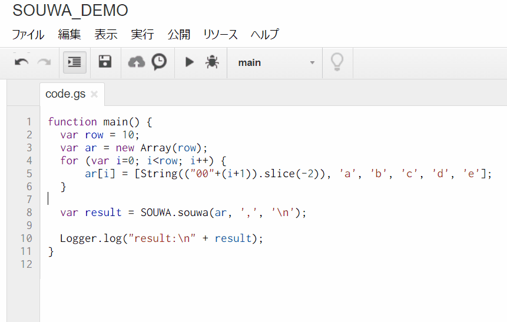

SOUWA
====

[](https://codeclimate.com/github/tanaikech/SOUWA_GAS)
[](https://codeclimate.com/github/tanaikech/SOUWA_GAS)

A library for Google Apps Script (GAS)

## Description
SOUWA means summing in Japanese.

SOUWA can sum string elements in an array at the high speed. The speed of SOUWA with the pyramid algorithm is about 380 times faster than that of the standard method. New algorithm for summing array elements was developed for SOUWA. You can see the detailed report of this library at [here](https://tanaikech.github.io/2016/10/13/improved-algorithms-for-summation-of-array-elements/). If you are interested in this, I'm glad.

## Demo



## Requirement

- Google account

## Usage
- Add the library to your GAS project. You can see how to add the library at [here](https://developers.google.com/apps-script/guide_libraries).

- Put the script ID of the library to "Find a Library" at Resources > Libraries. The script ID is "1yI93fL6G-jJwdYLCXSnbOkluQntDWo6QLARB6dMqObcJd-BYBd6wyasz".

- You can use this by following command.

```
var sum = SOUWA.souwa(Array, Delimiter, Endcode);
```

Array is 1 or 2 dimentions.  e.g. Array = [a, b, c,,,,,] or Array = [[a, b, c], [d, e, f, g],,,,,]. Delimiter is ',' and ':' and etc. Endcode is '\n' and '\r\n' and etc.

## Sample script
A sample used at demo.

```
function main() {
  var row = 10;
  var ar = new Array(row);
  for (var i=0; i<row; i++) {
      ar[i] = [String(("00"+(i+1)).slice(-2)), 'a', 'b', 'c', 'd', 'e'];
  }

  var result = SOUWA.souwa(ar, ',', '\n');

  Logger.log("result:\n" + result);
}
```

## Theory of This Algorithm
Theory of this algorithm is [here](https://tanaikech.github.io/2016/10/13/improved-algorithms-for-summation-of-array-elements/).

## Acknowledgements
I would like to thank Google and Google staff.

## Licence
[MIT](LICENCE)

## Author
[TANAIKE](https://github.com/tanaikech)

